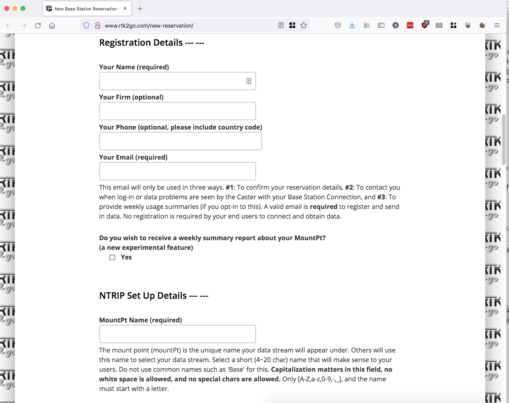
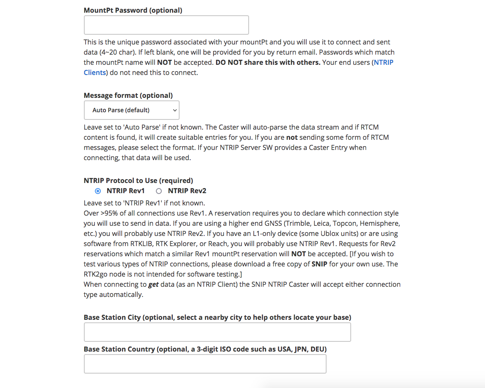
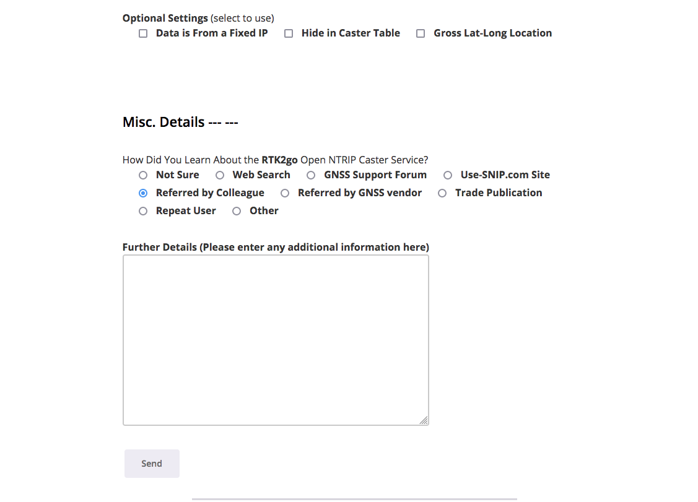

# GPS

## Paikannuksen perusteet

GPS-paikannuksella päästään nykyisin tyypillisesti muutaman metrin tarkkuuteen, joka esim maanteilla navigoidessa on enemmän kuin tarpeeksi, muttei vielä mahdollista tarkempaa ajamista itsekseen. Maantiellä nykyisin itseohjautuvat uudet autot hoitavat suunnan pitämisen lähinnä konenäkö-tekniikoiden avulla, koska tarkemmasta GPS-sijainnista ei juurikaan olisi hyötyä kunnes tiet ja niiden muutokset olisi reaaliaikaisesti senttitarkkuudella kartoitettu.

Pellolla sen sijaan vierekkäisiä uria ja toistuvasti samoja lohkoja ajessa tarkasta paikkatiedosta on kameradataa enemmän hyötyä. Tällöin avoimen GPS-signaalin rinnalle otetaan sitä tarkentava korjaus-signaali, joita on käytännössä kahta eri tekniikkaa.

Tähän asti olen käyttänyt sanaa GPS paikannusjärjestelmistä, mutta oikeastaan pitäisi puhua GNSS-järjestelmistä joita ovat ovat vanhimman, jo 90-luvulla käyttöön otetun GPS:n (USA) lisäksi Galileo (EU), Glonass (Venäjä) ja uusimpana maailmanlaajuisesti toimivana Kiinalaisten BeiDou. Viimeisin ei ole vielä kovin laajassa käytössä vuonna 2021 kun verkko valmistui käyttökuntoon kesällä 2020 ja vastaanottimia ei ole kauaa ollut yleisesti saatavilla.

Kukin paikannusjärjestelmä on perusperiaatteltaan kovin samantyyppinen, Maata kiertää muutamia kymmeniä satelliitteja tunnetuilla kiertoradoilla, nämä lähettävät radiosignaalina omaa paikkaansa sekä tarkkaa aikasignaalia. Vastaanotin kuuntelee yhtäaikaa mahdollisimman montaa satelliittiä, käytännössä avoimella paikalla näitä on kussakin verkosssa kaikkina ajanhetkinä horisontin yläpuolella vähintään 6 joista neljän signaalin perusteella voidaan paikka laskea. Mitä useampia signaaleja vastaanotetaan, ja mitä kauempana toisistaan kuultavat satelliitit ovat, sitä parempaan tarkkuuteen päästään. Käytännössä useimmat nykyvastaanottimet seuraavatkin samaan aikaan useamman eri verkon signaaleja.

Diffrentiaali-GPS, DGPS perustuu tunnetussa sijainnissa olevan tukiaseman vastaanottamaan paikkatietoon, ja reaaliaajassa tehtävänään vertailuun lasketun ja tunnetun sijainnin erotukseen. Tämä erotus lähetettään liikkuville vastaanottimille muodossa "sain juuri nyt sijaintini eroksi 6m lähteen ja 3m etelään, korjaa omaa gnss-signaalista laskemaasi paikkaa vastaavasti. Eli siis voidaan olettaa virheen olevan samansuuntainen ja -suuruinen myös liikkuvan vastaanottimen kohdalla

todo:
virhelähteet
rtk
gps-linkki suomi-wikipedia
kaupalliset korjauss-signaalit
kiihtyvyysanturit

## Antennin asennuspaikka

Kuten edellä todettiin, GNSS-paikkasignaali on sitä parempi mitä enemmän satelliittejä kuullaan, eri puolilta näkyvää taivasta. Antennin olisi siis hyvä sijaita mahdollisimman korkealla ja avoimella näkyvyydellä eri suuntiin. Maatilaympäristössä viljankuivaamon katto olisi monesti paras paikka, mutta teknisesti hiukan haastava sekä fyysisen asennuksen että kaapelointien suhteen. Matalammat rakennuksetkin toimivat kunhan lähistöllä ei ole liikaa korkeita puita tai muita rakennuksia rajaamassa näkyvyyttä. GPS-signaali gigahertsitaajuusluokassa läpäisee varsin huonosti esteitä, käytännössä puhutaan avoimesta näkyvyydestä taivaalle.

AgOpenGPS:n suosittelemassa GNSS-vastaanottimessa mukana tuleva antenni vaatii alustakseen metallia, mielellään pyöreä tasainen levy noin parinkymmenen sentin säteellä tai riittävän suuri (=metrejä joka suuntaan) yhtenäinen, maadoitettu metallipinta, esim katto. Antennin kiinnitys tapahtuu magneetilla sekä tarvittaessa lisäksi ruuveilla.

Tukiaseman asennuksessa on syytä huomioida ukkos-suojaus riittävästi, eli käytönnössä tarpeeksi paksu maadoituskaapeli suoraan kiinteistön maadoitukseen.

Traktori-asennuksessa järkevin ja softan asetuksen osalta myös ainoa hyvin toimiva paikka on ohjaamon katolla, taka-akselin etupuolella. Tässäkin antennin alle tarvitaan metallipinta joka on maadoitetava koneen runkoon. Helpointa asennus toki on jos hytin katto sattuu olemaan peltiä, tällön magneetti-antennin heittäminen katolle ja johdon veto hyttiin riittää. Harmillisesti traktorivalmistajat ovat kuitenkin käyttäneet monesti muovia nykykoppiensa katoissa ja tarvittavan metallipinnan joutuu sinne erikseen rakentamaan.

## Tukiaseman softa, RaspberryPi-image

Helpoksi tavaksi tukiaseman pystyttämiseen on osoittautunut RaspberryPi-korttitietokoneen ja valmiin käyttöjärjestelmä-imagen käyttäminen. RaspberryPi on Brittiläisen säätiön alunperin opetukäyttöön luoma pieni tietokone josta on vuosien varrella julkaistu eri versiota, ja joka on kerännyt hyvin laajan harrastajakunnan erilaisiin käyttötarkoituksiin.

Suositeltavin malli tähän käyttöön on [3B+](https://www.verkkokauppa.com/fi/product/24605/kcjmm/Raspberry-Pi-3-model-B-yhden-piirilevyn-tietokone) joka maksaa hiukan alle 50e. Uudempi 4-malli on huomavattavsti tehokkaampi, mutta tässä kohtaa siitä ei ole hyötyä, päinvastoin lisääntynyt teho vaatii suurempaa virtalähdettä sekä aktiivista jäähdytystä.

Vakiona mukana ei tule minkäänlaista koteloa tai virtalähdettä, virransyöttö on normaalilla micro-usb liittimellä ja tehokkaat kännykänlaturit toimivat. Käytännössä virtalähteessä pitää olla tarpeeksi tehoa, 2A pitäisi yleensä riittää kun käyttää tarpeeksi laadukasta eli johtimiltaan sopivan paksua kaapelia. Ikean myymät [laturit](https://www.ikea.com/fi/fi/p/koppla-3-paikkainen-usb-laturi-valkoinen-20415027/) ja [USB-kaapelit](https://www.ikea.com/fi/fi/p/lillhult-usb-a-mikro-usb-johto-tummanharmaa-70484792/) ovat monen harrastajan hyväksi toteamia valintoja.

Kotelon osalta tietokonekauppiaden harrastuskäyttöön myymät erilaiset kotelot eivät ehkä tässä käytössä ole tarpeellisia, vaan itse suosin sähkötarvikeliikkeestä/rautakaupasta asennuskoteloa joka on vesitiivis ajatellen asennusta esim kylmään ulkorakennukseen. Liian pientä ei kannata valita jos asennuspaikka ei ole ahdas, esim 15x10x8cm sisämitoilla oleva laatikko toimii oikein mukavasti tietokoneen, GPS-modulin sekä poe-virtalähteen asennukseen.

Tallenusmedianaan RPI käyttää micro-SD muistikorttia. Tämän ei tarvitse olla kovin iso, käytännössä 16 gigatavua jonka noin kympillä marketista saa, riittää paremmin kuin hyvin tähän käyttöön.

### Kortille asennetaan https://github.com/Stefal/rtkbase ohjelma.

* Lataa valmis käyttöjärjestelmä-image osoitteesta https://github.com/jancelin/pi-gen/releases ( Base_GNSS_<versio>.zip, noin 500 megatavua.
* pura zip-paketti, saat .img-tiedoston
* lataa esim https://www.balena.io/etcher/ jolla image kirjoitetaan muistikortille
* asenna kortti RPI:lle, kytke verkkokaapelilla samaan verkkoon pc:n kanssa
* avaa basegnss.local-sivu, salasana "admin"  

## Poe-sähkönsyöttö tukiasemalle

Koska tukiaseman tietokone on saatava 5m antennikaapelin etäisyydelle antennista, tarkoittaa se monesti sijaintia jossa ei välttämättä ole sähkötöpseliä helposti saatavilla. Ja koska tukiasema tarvitsee kuitenkin verkkoa, on yksi johto yleensä jokatapauksessa tarpeen vetää. Helpoimmillaan tämä on silloin ethernet-johto joka kytketään toisesta päästään reitittimeen, ja toisesta päästä tukiaseman tietokoneeseen, mutta väliin lisätään Power-over-ethernet muuntimet. Reitittimen päähän tulee [injektoriksi](https://www.verkkokauppa.com/fi/product/60099/gmnxd/TP-LINK-TL-POE150S-PoE-injektori) kutsuttu laite joka lisää verkkokaapeliin yleensä 48v DC-sähkön, ja tukiaseman päähän vastaavasti [poe-extractor](https://www.verkkokauppa.com/fi/product/53361/gvdhk/TP-LINK-TL-POE10R-PoE-splitter).

Injektorin voi toki korvata myös Poe-kytkimellä mikäli sähköä käyttäviä laitteita on useita. Esimerkki tälläisestä: https://www.verkkokauppa.com/fi/product/55086/mtggh/TP-LINK-TL-SG1005P-V2-5-porttinen-kytkin

Maailmalta löytyy myös toimivaksi havaittuja [POE-splittereitä](https://www.aliexpress.com/item/1005001356576287.html) joissa on suoraan RaspberryPi:stä löytyvä microusb-liitin. Tälläisen kanssa ei ole tarvetta erikseen kolvata sopivaa kaapelia väliin.

Poe-laitteiden kanssa on syytä tarkistaa että virransyöttö on riittävä, käytännössä minimitarve on 5V dc 2A.

Saatavilla on myös edullisempia "passive poe"-palikoita ja kaapeleita jotka eivät ole IEEE 802.3af tai muunkaan standardin mukaisia, vaan pelkästään passiivisia kytkentöjä niin että reittittimen päähän tulee laitteen alkuperäinen virtalähde. Näiden käyttö Raspberryn ja 5v syöttöjännitteen kanssa ei ole järkevää, ohuen ethernet-kaapelin häviöt ovat liian suuret ilman korkeamman jännitteen käyttämistä.

## rtk2go

http://rtk2go.com/ on vapaasti käytetävissä oleva internetpalvelu joka tarjoaa NTRIP-korjausdatan välityspalvelun. Palvelu perustu SNIP-ohjelmistoon jonka voisi asentaa myös omalle tietokoneelle, mutta tässä käyttötapauksessa jonkun muun ylläpitämä palvelu on kovasti helppo ratkaisu.

Heidän käyttöehdoissa sanotaan:

> Terms of Use: By sending your data stream to this Caster you affirm that:
> a) You have the right to do so, and
> b) You consent to allow others to freely use your data, and
> c) The caster owner / operator shall be held harmless for any faults or loss – real or perceived.
> The caster owner / operator (SCSC) reserves the right to remove or block any party for abuse.

Eli: a) sinulla on lupa lähettää dataa, käytännössä tukiaseman tarkkaa paikkatietoa ja b) annat sen muiden vapaaseen käyttöön. Kohta c, palvelun tarjoaja ei vastaa mistään menetyksistä ja voi lopettaa palvelun tarjoamisen väärinkäyttäjille. Ei siis mitään erikoista.

Datan lähettäminen palveluun vaatii rekisteröitymisen http://www.rtk2go.com/new-reservation/

Lomake vaatii nimesi, toimivan sähköpostiosoitteen (ei julkaista missään) sekä MountPT Name:n joka on julkisesti tukiasemasi yksilöivä tieto. Kannattaa huomioida että tämä julkaistaan yhdessä senttitarkan sijainnin kanssa, joten esim oma nimesi ei välttämättä ole järkevin valinta jos antenni on talosi katolla. Tilan nimi tai muu vastaava on oikein toimiva, 4-20 kirjainta tai numeroa ilman välilyöntejä, viiva ja alaviiva ovat sallittuja erikoismerkkejä. Nimessä pienet ja isot kirjaimet ovat eri asia.

Salasanakentän voi jättää tyhjäksi tässä kohtaa, jolloin palvelu lähettää sinulle tarvittavan satunnais-salasanan. Tätä ei tarvitse syöttää kuin kerran tukiaseman asetuksiin, joten arvottu satunnaismerkkijono on hyvä.

Message Format ja ntrip protocol voi jättää oletusasetuksiinsa, samoin kuin optional settingsin valintaboksit.

Kaupunki ja maakoodi (FIN) ovat näkyvillä tukiasemien listauksessa.

Mistä kuulit RTK2go:sta voi hyvin täyttää "Referred by Colleague" jos luet aiheesta täältä ensimmäistä kertaa...

Lähettämisen jälkeen sähköpostistasi pitäisi löytyä vastausviesti, johon pitää vastata jotta rekisteröinti etenee. Tämän jälkeen ihminen käsittelee ilmoituksesi ja saat sen jälkeen erikseen kuittausviestin jossa on tukiaseman yhdistämiseen tarvittavat tiedot.

## Gps:n asetukset

## Tukiaseman paikan määritys

## Rtk2go oikeat parametrit, lähettävät viestityypit
